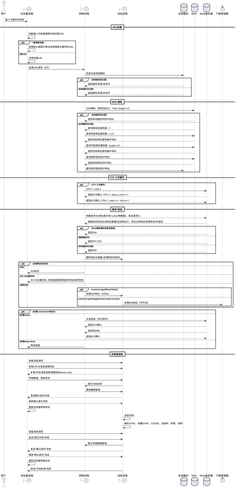

## 前言

从输入 URL 到浏览器渲染了什么，这个过程中发生了什么。

```puml
@startuml

actor 用户
boundary 浏览器进程
boundary 网络进程
boundary 渲染进程
database 本地缓存
database DNS
database Web服务器
control 下载管理器

用户 -> 浏览器进程: 输入关键字并回车

== URL处理 ==

浏览器进程 -> 浏览器进程: 判断输入内容是搜索内容还是URL
alt 是搜索内容
    浏览器进程 -> 浏览器进程: 使用默认搜索引擎合成带搜索关键字的URL
else 是URL
    浏览器进程 -> 浏览器进程: 合成完整URL
end

浏览器进程 -> 网络进程: 发送URL请求（IPC）
网络进程 -> 本地缓存: 检查本地资源缓存
alt 本地缓存有记录
    本地缓存 --> 网络进程: 返回缓存资源/未命中
else 本地缓存无记录
    本地缓存 --> 网络进程: 返回缓存资源/未命中
end

== DNS 解析 ==

网络进程 -> DNS: DNS解析（假设地址为：http://juejin.cn）
alt 本地缓存有记录
    DNS --> 网络进程: 返回本地缓存中的IP地址
else 本地缓存无记录
    DNS --> 网络进程: 查询根域名服务器（.）
    网络进程 -> DNS: 查询顶级域名服务器（.cn）
    DNS --> 网络进程: 返回顶级域名服务器IP地址
    网络进程 -> DNS: 查询次级域名服务器（juejin.cn）
    DNS --> 网络进程: 返回次级域名服务器IP地址
    网络进程 -> DNS: 查询目标域名的IP地址
    DNS --> 网络进程: 返回目标域名的IP地址
    网络进程 -> 本地缓存: 缓存目标域名和IP地址
end

== TCP 三次握手 ==

alt TCP 三次握手
    网络进程 -> Web服务器: SYN=1, seq=x
    Web服务器 --> 网络进程: 返回ACK确认, SYN=1, seq=y, ack=x+1
    网络进程 --> Web服务器: 返回ACK确认, SYN=1, seq=x+1, ack=y+1
end

== 请求/响应 ==

网络进程 --> Web服务器: 构建请求头(域名相关的Cookie等数据)、发送请求头

Web服务器 --> 网络进程: 根据请求信息生成响应数据(包括响应行、响应头和响应体等信息)并返回

alt Web服务器检测是否更新
    Web服务器 --> 网络进程: 返回304
else  需要重定向
    Web服务器 --> 网络进程: 返回301/302
else 本地缓存无记录
    Web服务器 --> 网络进程: 返回200
end

网络进程 -> 渲染进程: 解析响应头数据,处理响应状态码

alt 处理响应状态码
else  304
    网络进程 -> 浏览器进程: 304响应
else  301/302重定向
    网络进程 -> 浏览器进程: 301/302重定向, 浏览器会跳转到新的地址继续导航
else 返回200
    alt content-type为text/html
        网络进程 -> 渲染进程: 处理200响应（HTML）
    else content-type为application/octet-stream
        渲染进程 -> 下载管理器: 处理200响应（字节流）
    end
end


alt 处理Connection响应头

else 处理close
    网络进程 -> Web服务器: 关闭连接（四次挥手）
    Web服务器 --> 网络进程: 返回ACK确认
    Web服务器 --> 网络进程: 发送响应体
    网络进程 --> Web服务器: 返回ACK确认
else 处理keep-alive
    网络进程 -> 浏览器进程: 保持连接
end

== 浏览器渲染 ==

浏览器进程 -> 渲染进程: 准备渲染进程
浏览器进程 -> 渲染进程: 检查URL与渲染进程域名
渲染进程 --> 浏览器进程: 复用/开启渲染进程(根据是否same-site)

浏览器进程 -> 渲染进程: 传输数据、更新状态
渲染进程 -> 网络进程: 提交文档消息
网络进程 -> 渲染进程: 接收数据管道
渲染进程 --> 浏览器进程: 发送确认提交消息
浏览器进程 --> 渲染进程: 接收确认提交消息

浏览器进程 -> 浏览器进程: 更新浏览器界面状态
渲染进程 -> 渲染进程: 渲染页面
渲染进程 -> 渲染进程: 解析HTML、构建DOM、CSSOM、渲染树、布局、绘制

浏览器进程 -> 渲染进程: 准备渲染进程
浏览器进程 -> 渲染进程: 发送“提交文档”消息
渲染进程 -> 网络进程: 建立传输数据管道
渲染进程 --> 浏览器进程: 发送“确认提交”消息
浏览器进程 --> 渲染进程: 接收“确认提交”消息

浏览器进程 -> 浏览器进程: 更新浏览器界面状态
渲染进程 -> 浏览器进程: 发送“文档完成”消息

@enduml
```